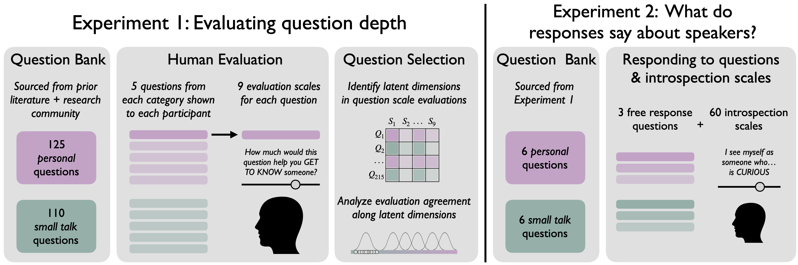

# How do we get to know someone?  Diagnostic questions for inferring personal traits

**Abstract**

When first meeting somebody, we're faced with the challenge of "getting to know them." Why do some questions seem to enable this better than others? In Experiment 1, participants ($N=185$) evaluated a large bank of conversational questions. We found that questions varied along a reliable latent dimension of interpersonal depth ranging from "small talk" to "deep" questions. In Experiment 2 ($N=188$), participants answered a subset of these questions along with a number of self-report personality scales. Using a language model to estimate how informative participants' free responses were, we find that individualized personality predictions were more accurate when incorporating free responses; furthermore, responses to deeper questions supported more accurate personality inferences than small talk. Taken together, results suggest not only that responses contained the statistical information necessary to make abstract social inferences, but also that people have accurate intuitions about which conversational topics enable learning about and connecting with others.

**Full pre-print available [HERE](https://osf.io/preprints/psyarxiv/k6zme_v1)**

## In this directory

`/analysis`: Scripts used to prepare data and perform analyses reported in the CogSci paper

`/data`: Data from behavioral experiments and GPT model predictions

`/experiments`: Code for behavioral experiments reported in the CogSci paper

`/models`: Code for GPT modeling pipeline reported in the CogSci paper

`/results`: Figures generated by the analysis scripts in `/analysis`

`/stimuli`: Stimuli used in the behavioral experiments: files for the *question bank* of free response questions in experiment 1 and *introspection scales* given to participants in experiment 2

## CRediT Statement

*What is a [CRediT author statement](https://www.elsevier.com/researcher/author/policies-and-guidelines/credit-author-statement)?*

| Term                       | Definition                                                                                                                                                                                                    | Erik Brockbank | Tobias Gerstenberg | Judith E. Fan | Robert Hawkins |
|----------------------------|---------------------------------------------------------------------------------------------------------------------------------------------------------------------------------------------------------------|----------------|--------------------|---------------|----------------|
| Conceptualization          | Ideas; formulation or evolution of overarching research goals and aims                                                                                                                                        | x              | x                  | x             | x              |
| Methodology                | Development or design of methodology; creation of models                                                                                                                                                      | x              | x                  | x             | x              |
| Software                   | Programming, software development; designing computer programs; implementation of the computer code and supporting algorithms; testing of existing code components                                            | x              |                    |               |                |
| Validation                 | Verification, whether as a part of the activity or separate, of the overall replication/ reproducibility of results/experiments and other research outputs                                                    | x              |                    |               | x              |
| Formal analysis            | Application of statistical, mathematical, computational, or other formal techniques to analyze or synthesize study data                                                                                       | x              |                    |               |                |
| Investigation              | Conducting a research and investigation process, specifically performing the experiments, or data/evidence collection                                                                                         | x              |                    |               |                |
| Resources                  | Provision of study materials, reagents, materials, patients, laboratory samples, animals, instrumentation, computing resources, or other analysis tools                                                       |                |                    |               | x              |
| Data Curation              | Management activities to annotate (produce metadata), scrub data and maintain research data (including software code, where it is necessary for interpreting the data itself) for initial use and later reuse | x              |                    |               |                |
| Writing - Original Draft   | Preparation, creation and/or presentation of the published work, specifically writing the initial draft (including substantive translation)                                                                   | x              |                    |               | x              |
| Writing - Review & Editing | Preparation, creation and/or presentation of the published work by those from the original research group, specifically critical review, commentary or revision – including pre-or postpublication stages     | x              | x                  | x             | x              |
| Visualization              | Preparation, creation and/or presentation of the published work, specifically visualization/ data presentation                                                                                                | x              |                    |               | x              |
| Supervision                | Oversight and leadership responsibility for the research activity planning and execution, including mentorship external to the core team                                                                      | x              | x                  | x             | x              |
| Project administration     | Management and coordination responsibility for the research activity planning and execution                                                                                                                   | x              | x                  | x             | x              |
| Funding acquisition        | Acquisition of the financial support for the project leading to this publication                                                                                                                              | x              | x                  | x             | x              |

